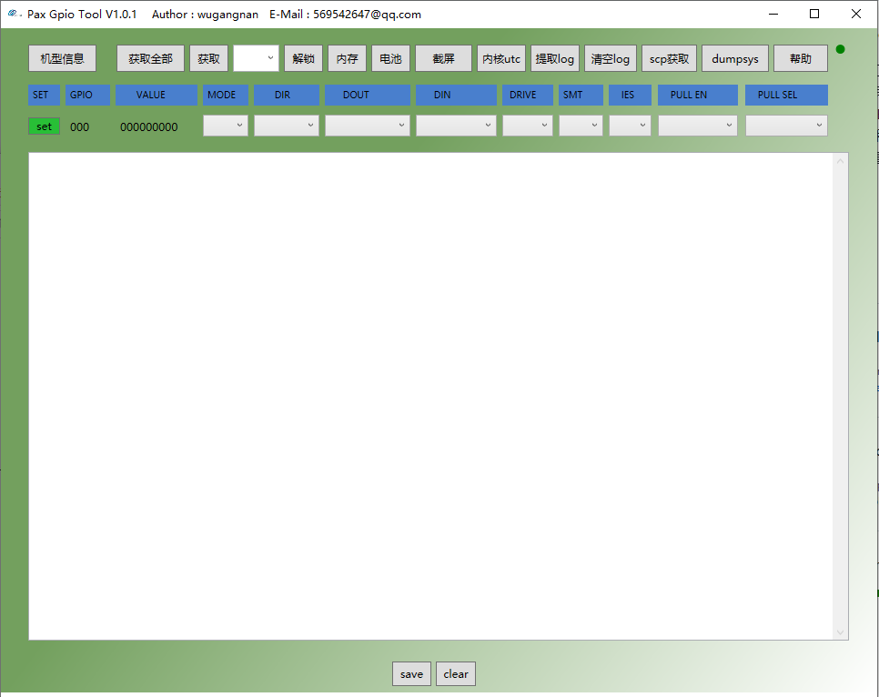

# Pax_Gpio_Tools_V1.0.1
## 界面

---
## 参数说明
### GPIO参数
* [MODE] 当前pin处于的mode
* [DIR] 0：input pin, 1：output pin
* [DOUT] 输出值
* [DIN] 输入值
* [DRIVE] 驱动能力,一般可取值0～7
* [SMT] 使能施密特触发器
* [IES] 输入使能，1：input信号有效 0：input信号无效
* [PULL_EN] 只对input pin有效，使能上/下拉
* [PULL_SEL] 只对input pin有效，1：上拉 0：下拉
* ([R1 R0]) 当前GPIO pin的（上下拉）并联电阻的使能状态
```
0 0 表示disable R1，disable R0
1 0 表示enable R1，disable R0
0 1 表示disable R1，enable R0
1 1 表示enable R1， enable R0
```

> 注意：只有部分GPIO支持[R1 R0]并联电阻上下拉功能，且[PULL_EN]必须使能。

### 其他参数说明
* 状态指示灯
```
当打开软件后系统会检测是否存在adb设备，如果没接手机指示灯为红色，接了后变为绿色。
```
* 版本信息
```
主要是获取手机编译信息、编译作者、编译时间、Modem编译信息，平台、软件版本、BarCode、IMEI码，显示在下面对话框。
```
* 获取全部
```
获取全部GPIO信息。
```
* 解锁
```
unlock设备后，机器能够正常remount。
```
* 内存
```
获取系统内存使用情况。
```
* 电池
```
获取电池主要状态信息和dump register table。
```
* 截屏
```
注意：需要将该工具安装到非C盘路径，截图成功后保存在安装目录的Images目录下。
```
* 内核utc
```
将log/debuglogger目录所有的kernel log转换成带有utc时间的log。
```
* 提取log
```
提取MTK DebugLogger生成的log文件，成功后保存在安装目录的debuglogger目录下。
```
* 清空log
```
清空log/debuglogger目录下所有log文件。
```
* scp获取
```
抓取scp打印，sensor hub调试专用。
```
* dumpsys
```
提取android dumpsys信息，保存到log目录下。
```
* apk
```
将需要安装的apk文件放到apk目录下，点击apk按钮将全部自动安装到机器。
```
* clear
```
清屏。
```
* save
```
将屏幕信息保存至log目录。
```